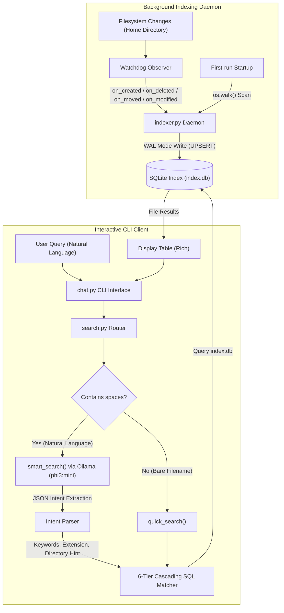

# FileChat: Local SLM-Powered Intelligent File Finder

FileChat is a high-performance, privacy-first, local command-line application that allows users to find files in their home directory using natural language queries. It operates by combining a real-time filesystem indexing daemon (`watchdog` + `SQLite`) with a local Small Language Model (SLM), specifically `phi3:mini` running via `Ollama`, to extract search intents and execute cascading fuzzy SQL queries.

---

## 1. System Architecture & Component Flow

The system is split into two asynchronous loops: the **Index Loop** (background) and the **Search Loop** (interactive). This decoupling guarantees sub-millisecond database queries while maintaining a near real-time catalog of the entire filesystem.



### 1.1 Indexing Loop (`indexer.py` + `filefinder.service`)
*   **Daemonization:** Runs as a systemd user-level background service (`filefinder.service`). It is enabled at system startup and auto-restarts on failure.
*   **Real-time Watcher:** Utilizes the cross-platform `watchdog` library to recursively monitor the user's home folder (`~/`). Events such as file creations, deletions, moves, and modifications are processed asynchronously.
*   **Storage Layer:** Stores metadata in `~/.local/share/filefinder/index.db`.
    *   **Schema:** `files(path TEXT PRIMARY KEY, name TEXT NOT NULL, extension TEXT, size INTEGER, mtime REAL)`.
    *   **Optimization:** Configured with `PRAGMA journal_mode=WAL` (Write-Ahead Logging) to allow concurrent readers (such as active search queries) to query the database without blocking the indexer's write operations.
    *   **Indices:** Case-insensitive indexing on filename (`idx_name` using `COLLATE NOCASE`) and extensions (`idx_ext`) guarantees sub-millisecond database lookups.
    *   **Pruning:** Completely skips heavy build, version control, and temporary folders (e.g., `.git`, `node_modules`, `.cache`, `.venv`, `__pycache__`) to maintain a clean, compact database footprint.

### 1.2 Intent Parser (`search.py`)
When a multi-word natural language query (like *"find the recursive least squares cpp file in Repos"*) is sent, the query is passed to `phi3:mini` via Ollama's local endpoint.
*   **Prompt Engineering:** The LLM is instructed via a specialized system prompt to extract only JSON structured data:
    *   `keywords`: An array of individual lowercase filename tokens (compound words split into separate elements, ignoring conversational filler words like "find", "where", "my").
    *   `extension`: The parsed file extension (without the dot).
    *   `directory`: A target subdirectory path hint (e.g. "Repos", "Downloads").
*   **Offline Fallback:** If the Ollama server is unreachable or times out (15s limit), the system falls back to a deterministic regex parser that filters out common English filler words and extracts tokens.

### 1.3 Cascading Search Engine (`search.py` + `chat.py`)
To prevent the user from receiving "No files found" due to overly restrictive search constraints (which often occur when an LLM hallucination limits the query), `search.py` implements a **6-tier cascading query relaxation strategy**:
1.  **Bare Filename Quick Path:** If the query is a single word with no spaces, it bypasses the LLM entirely and runs a fast SQLite wildcard match (`name LIKE '%query%'`).
2.  **Strict LLM Match:** Queries using all extracted keywords (using `AND`), the file extension, and the directory hint.
3.  **Extension Drop:** If step 2 yields zero results, it retries the query without the extension filter.
4.  **Directory Hint Drop:** If step 3 fails, it drops the directory directory scope.
5.  **Keyword Shrinkage:** If step 4 fails, it isolates only the top-2 longest (most specific) keywords to narrow down matching filenames.
6.  **Fuzzy OR Fallback:** If all else fails, it queries the database in `OR` mode, returning files matching *any* of the tokens, ordered by modification time.

---

## 2. Codebase Diagnostics & Bottleneck Analysis

Before the keyword normalization refactoring, search failures occurred due to mismatches between natural language queries and typical developer filesystem naming patterns:

| Aspect | User Query | Extracted Keywords (LLM) | Target Filename | SQL Match Strategy | Result |
| :--- | :--- | :--- | :--- | :--- | :--- |
| **Space vs Underscore** | `"online estimation"` | `["online estimation"]` | `On-Line_Estimation_of_...pdf` | `name LIKE '%online estimation%'` | **0 Results (Fail)** ❌ |
| **CamelCase Boundaries** | `"file chat"` | `["file chat"]` | `FileChat.py` | `name LIKE '%file chat%'` | **0 Results (Fail)** ❌ |
| **Delimiter Split** | `"online estimation"` | `["online", "estimation"]` | `On-Line_Estimation_of_...pdf` | `name LIKE '%online%' AND name LIKE '%estimation%'` | **Success** (WAL index hit) ✅ |

### The Normalization Solution (`_normalize_keywords`)
The system strips out filename noise and splits strings on spaces, underscores (`_`), hyphens (`-`), periods (`.`), and camelCase transitions (`([a-z])([A-Z])`). This transforms a query token like `"OnLine_Estimation"` into atomic lowercase components `["on", "line", "estimation"]`, bypassing the formatting differences between filesystems and human typing.

---

## 3. Gradual & Linear Micro-Update Roadmap (22 Incremental Enhancements)

The following list outlines **22 small, micro-level updates** designed to upgrade the system linearly. Each card specifies the goal, the affected files, the implementation mechanism, and the benefit, allowing developers to implement them one by one without breaking the existing architecture.

:::g-carousel
### Micro-Update 1: Exclude File Pattern Configuration (`.filefinder_ignore`)
*   **Files Modified:** `indexer.py`
*   **Technical Implementation:** Add support for reading a `.filefinder_ignore` file from the user's home folder on startup. Convert glob patterns into regex to filter paths in `full_scan` and the watchdog event handler.
*   **User Benefit:** Users can exclude folders (e.g., massive dataset folders, private folders) without hardcoding values in `indexer.py`.

<!-- slide -->
### Micro-Update 2: Interactive Page Navigation (Pagination)
*   **Files Modified:** `chat.py`
*   **Technical Implementation:** When search results exceed 15 items, wrap the rich table display in a loop that shows 10 items at a time and asks: `[n] Next page, [p] Previous page, [q] Quit`.
*   **User Benefit:** Prevents long file tables from flooding the terminal buffer, preserving readability.

<!-- slide -->
### Micro-Update 3: Interactive File Opener
*   **Files Modified:** `chat.py`
*   **Technical Implementation:** Introduce a `/open <index>` command (e.g. `/open 3`). Use Python's `subprocess.Popen` to launch files with `xdg-open` (Linux), `open` (macOS), or `start` (Windows).
*   **User Benefit:** Users can open files instantly from the search interface instead of copying paths.

<!-- slide -->
### Micro-Update 4: Copy-to-Clipboard Utility
*   **Files Modified:** `chat.py`
*   **Technical Implementation:** Add a `/copy <index>` command. Use standard terminal utilities (`xclip`/`xsel` on Linux, `pbcopy` on macOS) to copy the absolute file path.
*   **User Benefit:** Allows immediate copying of file paths for use in other terminal tabs or editors.

<!-- slide -->
### Micro-Update 5: Database Size & Threshold Warning
*   **Files Modified:** `chat.py`, `search.py`
*   **Technical Implementation:** During the `stats` command, measure the size of the database file on disk using `DB_PATH.stat().st_size`. If it exceeds 500MB, output a warning recommending index cleanup.
*   **User Benefit:** Alerts users if duplicate database files or heavy indexing is consuming excessive disk space.

<!-- slide -->
### Micro-Update 6: Dynamic Watchdog Event Debouncer
*   **Files Modified:** `indexer.py`
*   **Technical Implementation:** Replace direct database writes in the watchdog handler with a short queue. Debounce updates for the same file within a 500ms window.
*   **User Benefit:** Prevents rapid disk writes and locks when files are modified repeatedly during compiling or saving.

<!-- slide -->
### Micro-Update 7: Persistent Command History
*   **Files Modified:** `chat.py`
*   **Technical Implementation:** Configure `prompt_toolkit` to use a file-backed history adapter pointing to `~/.config/filefinder/history`.
*   **User Benefit:** Preserves user query history across terminal sessions, enabling upward-arrow navigation.

<!-- slide -->
### Micro-Update 8: Graceful Ollama Offline Alert
*   **Files Modified:** `chat.py`, `search.py`
*   **Technical Implementation:** During startup, send a quick HTTP HEAD request to `Ollama` (`http://localhost:11434`). If it fails, print a yellow banner: `Ollama offline. Falling back to fast regex matching.`
*   **User Benefit:** Eliminates confusion when Ollama isn't running by making fallback modes transparent.

<!-- slide -->
### Micro-Update 9: Dynamic File Count Badge in Prompt
*   **Files Modified:** `chat.py`
*   **Technical Implementation:** Query `db_stats()` asynchronously or on a loop, then embed the count in the input prompt string: `[54.2k files] You ❯`.
*   **User Benefit:** Provides continuous visual feedback confirming that the indexer daemon is active.

<!-- slide -->
### Micro-Update 10: Automatic Empty/Zero-Byte Filter
*   **Files Modified:** `indexer.py`
*   **Technical Implementation:** Add an optional check in `upsert()`: `if st.st_size == 0: return` to prevent indexing zero-byte placeholder files.
*   **User Benefit:** Filters out temp locks, empty files, and empty configs from search results.

<!-- slide -->
### Micro-Update 11: Case-Insensitive Extension Normalizer
*   **Files Modified:** `search.py`
*   **Technical Implementation:** Force `.lower()` and strip any prepended dots inside the cascading parser when comparing file extensions.
*   **User Benefit:** Ensures searches for "PDF" or ".pdf" both resolve cleanly to matches on ".pdf".

<!-- slide -->
### Micro-Update 12: Directory Path Component Truncation
*   **Files Modified:** `chat.py`
*   **Technical Implementation:** If the absolute path of a file exceeds 45 characters, replace intermediate folders with initials (e.g. `/home/user/Repos/project/src` -> `~/R/p/src/file`).
*   **User Benefit:** Prevents the search results table from wrapping and distorting on smaller terminals.

<!-- slide -->
### Micro-Update 13: Systemd Daemon Lifecycle Status Command
*   **Files Modified:** `chat.py`
*   **Technical Implementation:** Create a `/service` or `status` chat command that runs `systemctl --user is-active filefinder` and prints the daemon state.
*   **User Benefit:** Enables status diagnostics of the background watcher directly within the CLI.

<!-- slide -->
### Micro-Update 14: Lazily Filter Out Deleted Files
*   **Files Modified:** `search.py`
*   **Technical Implementation:** Before returning list entries from `search()`, verify existence with `os.path.exists(path)`. If a file is missing, delete it from the SQLite DB in a background thread and remove it from the active display list.
*   **User Benefit:** Eliminates stale results (files deleted while the indexer service was temporarily stopped).

<!-- slide -->
### Micro-Update 15: Directory Search Weighting Boost
*   **Files Modified:** `search.py`
*   **Technical Implementation:** In the SQL `ORDER BY` statement, assign a priority multiplier to files located in the current working directory (`CWD`) of the `chat.py` process.
*   **User Benefit:** Prioritizes search results that are closer to the user's current terminal context.

<!-- slide -->
### Micro-Update 16: Automated SQLite Database Vacuum
*   **Files Modified:** `indexer.py`
*   **Technical Implementation:** Track the number of modifications. Every 5,000 watchdog write operations, run a background thread command `VACUUM;`.
*   **User Benefit:** Reclaims unused database disk space automatically, keeping the index size optimized.

<!-- slide -->
### Micro-Update 17: Exclude System/Hidden Files Toggle
*   **Files Modified:** `chat.py`, `search.py`
*   **Technical Implementation:** Add a `/hidden` command toggle. When disabled, append `AND name NOT LIKE '.%'` to SQL clauses.
*   **User Benefit:** Allows users to hide dotfiles and system configurations to focus on their documents.

<!-- slide -->
### Micro-Update 18: File Category Filters (MIME Classification)
*   **Files Modified:** `search.py`
*   **Technical Implementation:** Map file extensions to categories (e.g., `png, jpg` -> `image`; `mp3, wav` -> `audio`). Allow syntax queries like `type:image` to filter results in SQL.
*   **User Benefit:** Provides natural grouping searches (e.g., finding "vacation photos" by filtering for images).

<!-- slide -->
### Micro-Update 19: Indexer CPU Idle-Throttling
*   **Files Modified:** `indexer.py`
*   **Technical Implementation:** In the main scan loop of `full_scan`, call `os.getloadavg()`. If CPU load is high, insert a small sleep delay (`time.sleep(0.05)`) to yield cycles.
*   **User Benefit:** Ensures the initial full-system scan does not cause system lag during active use.

<!-- slide -->
### Micro-Update 20: Regex Search Syntax Bypass
*   **Files Modified:** `chat.py`, `search.py`
*   **Technical Implementation:** If a query starts with `/re `, bypass the LLM and the cascading engine. Pass the remainder of the query to a custom SQLite user-defined regex function.
*   **User Benefit:** Allows developers and power users to run regular expression filename lookups.

<!-- slide -->
### Micro-Update 21: Auto-update Home Path Expansion
*   **Files Modified:** `search.py`
*   **Technical Implementation:** Wrap all database path strings returned from `search.py` in a helper that replaces the prefix `/home/username` with `~`.
*   **User Benefit:** Saves screen real estate in the path column, rendering directories in a clean, standard Unix format.

<!-- slide -->
### Micro-Update 22: Indexer Progress Bar for Initial Scan
*   **Files Modified:** `indexer.py`
*   **Technical Implementation:** During the initial boot file-count scan, write transient progress counts to `/tmp/filefinder.booting`. Have `chat.py` read this to display a progress indicator if a search is run during startup.
*   **User Benefit:** Keeps the user informed if they try to search immediately after installing the application.
:::

---

## 4. Setup & Deployment Instructions

### Prerequisites
*   Ubuntu/Debian-based Linux distribution (commands use `apt`)
*   Python 3.10+
*   Ollama installed and running locally with the `phi3:mini` model pulled:
    ```bash
    # Install Ollama (if not already installed)
    curl -fsSL https://ollama.com/install.sh | sh
    
    # Pull the required small language model
    ollama pull phi3:mini
    ```

### Installation
Run the setup script from the repository folder:
```bash
cd filefinder
bash setup.sh
```

The script will automatically:
1.  Install dependencies (`watchdog`, `rich`, `prompt-toolkit`, `requests`) via APT.
2.  Template the systemd configuration file with absolute directory paths.
3.  Register and start the background indexer service under the user systemd manager.

### Service Commands
Verify and control the indexing daemon using these command scopes:
```bash
# Check if the service is running and view stats
systemctl --user status filefinder.service

# Stream live indexer logs (e.g. watching files get added)
journalctl --user -u filefinder.service -f

# Restart indexer daemon
systemctl --user restart filefinder.service
```

### Usage
Start the interactive search console:
```bash
python3 chat.py
```
Type query commands or ask for files (e.g., *"show me my recursive least squares code"* or *"where is the tax invoice PDF"*).
