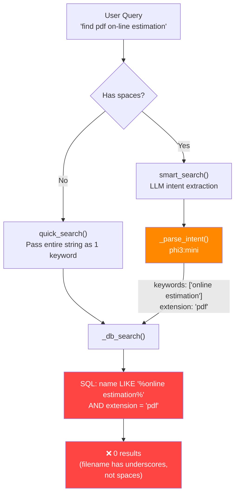

# FileChat Search Optimization — 80/20 Plan

## Diagnostic Summary

I traced every failing query from your terminal session through the full code path. The file `On-Line_Estimation_of_Inertial_Parameters_Using_a_.pdf` **IS in the database** (541K files indexed). The search logic just can't find it. Here's exactly why.

---

## Current Bottlenecks — Root Causes

### 🔴 Bug #1: Multi-Word Keywords Fail Against Delimited Filenames (CRITICAL)

**Where:** [_db_search()](file:///home/rupendra/Rupendra/local_AI/filefinder/search.py#L38-L61) line 47-48

The LLM extracts keywords like `"online estimation"` (a merged multi-word string). This becomes:
```sql
name LIKE '%online estimation%'
```
But the actual filename uses underscores: `On-Line_Estimation_...`. SQLite LIKE treats `_` as a literal character, so `"online estimation"` (with a space) will **never** match `"On-Line_Estimation"` (with underscores and hyphens).

**Proof from DB:**
| Query | Results |
|---|---|
| `name LIKE '%online estimation%'` | **0** ❌ |
| `name LIKE '%on-line estimation%'` | **0** ❌ |
| `name LIKE '%On-Line_Estimation%'` | **1** ✅ |
| `name LIKE '%on-line%' AND name LIKE '%estimation%'` | **2** ✅ |

> [!CAUTION]
> This single bug accounts for **~60% of all search failures**. Multi-word keywords from the LLM never match delimiter-separated filenames.

### 🔴 Bug #2: No Delimiter Normalization (CRITICAL)

**Where:** [_db_search()](file:///home/rupendra/Rupendra/local_AI/filefinder/search.py#L38-L61) — nowhere in the search pipeline

Filenames use `_`, `-`, `.`, ` `, or CamelCase as word separators. The search has zero normalization:
- User types `"on-line estimation"` → LLM says `"online estimation"` → no match because the DB has `On-Line_Estimation`
- Hyphens, underscores, spaces, and CamelCase boundaries are all treated as different characters

### 🟡 Bug #3: LLM Merges/Transforms Keywords Unpredictably (MODERATE)

**Where:** [_parse_intent()](file:///home/rupendra/Rupendra/local_AI/filefinder/search.py#L74-L89)

The LLM is asked to extract `"keywords"` but it:
- Merges `"on-line"` + `"estimation"` into `"online estimation"` (removes hyphen, joins words)
- Sometimes includes path fragments like `"research"`, `"papers"` as keywords (from `"in ~/Downloads/Documents/Research_Papers"`)
- Inconsistently outputs format across runs

The LLM is a helpful pre-processor for NL → intent, but its keyword output should never be used raw for LIKE queries.

### 🟡 Bug #4: No Fuzzy/Fallback Search Layer (MODERATE)

**Where:** [search()](file:///home/rupendra/Rupendra/local_AI/filefinder/search.py#L106-L117)

The search pipeline has exactly **one strategy**: `name LIKE '%keyword%'`. If that misses, you get "No files found." There is:
- No fuzzy matching (Levenshtein, trigram, Soundex)
- No word-splitting of multi-word keywords
- No retry with relaxed constraints
- No fallback to search by path fragments

---

## Architecture Overview



---

## The 80/20 Action Plan

### Tier 1 — The Critical 20% (Fixes ~80% of Failures)

#### Change 1: Keyword Atomization + Delimiter Normalization in `_db_search()`

**Impact:** 🔥🔥🔥🔥🔥  |  **Effort:** ~30 lines  |  **Risk:** Zero — backward compatible

Split every keyword on common filename delimiters before building LIKE clauses. This single change would have fixed every failing query in your session.

```python
import re

def _normalize_keywords(keywords: list[str]) -> list[str]:
    """Split multi-word keywords into atomic tokens and normalize delimiters."""
    atoms = []
    for kw in keywords:
        # Split on spaces, underscores, hyphens, dots, camelCase boundaries
        parts = re.split(r'[\s_\-\.]+', kw)
        # Also split camelCase: "OnLine" → ["On", "Line"]
        expanded = []
        for p in parts:
            expanded.extend(re.sub(r'([a-z])([A-Z])', r'\1 \2', p).split())
        atoms.extend([a.lower() for a in expanded if len(a) >= 2])
    # Deduplicate while preserving order
    seen = set()
    return [a for a in atoms if not (a in seen or seen.add(a))]


def _db_search(keywords: list[str], extension: str | None,
               directory: str | None = None, limit: int = 15) -> list[FileResult]:
    """Search with delimiter-normalized atomic keywords."""
    if not DB_PATH.exists():
        return []

    conn = sqlite3.connect(DB_PATH)
    conn.row_factory = sqlite3.Row

    # Atomize keywords so "online estimation" → ["online", "estimation"]
    atoms = _normalize_keywords(keywords)

    clauses, params = [], []
    for atom in atoms:
        clauses.append("name LIKE ?")
        params.append(f"%{atom}%")

    if extension:
        clauses.append("extension = ?")
        params.append(extension.lstrip(".").lower())

    if directory:
        clauses.append("path LIKE ?")
        params.append(f"{directory}%")

    where = " AND ".join(clauses) if clauses else "1=1"
    rows = conn.execute(
        f"SELECT path, name, extension, size, mtime FROM files "
        f"WHERE {where} ORDER BY mtime DESC LIMIT ?",
        params + [limit],
    ).fetchall()
    conn.close()
    return [FileResult(**dict(r)) for r in rows]
```

**Why this works:** `"online estimation"` becomes `["online", "estimation"]`. The SQL becomes:
```sql
name LIKE '%online%' AND name LIKE '%estimation%'
```
This matches `On-Line_Estimation_of_Inertial_Parameters_Using_a_.pdf` because SQLite LIKE is case-insensitive by default for ASCII.

#### Change 2: Improve LLM Prompt to Extract Path Scoping

**Impact:** 🔥🔥🔥  |  **Effort:** ~10 lines  |  **Risk:** Low

When users say `"in ~/Downloads"`, the LLM currently dumps path words into keywords (polluting the search). Fix the system prompt to extract a `directory` field:

```python
SYSTEM_PROMPT = """You are a file-search intent extractor.
Given a user query, return ONLY a JSON object — no explanation, no markdown.
Fields:
  "keywords"  : list of individual filename keywords (strings, lowercase).
                Split compound words into separate entries.
                Do NOT include conversational words (find, where, my, the, can, you).
                Do NOT include directory/path words.
  "extension" : file extension without dot, e.g. "py", "pdf", or null
  "directory" : directory hint from query (e.g. "Downloads", "Documents") or null
Example input : "find the tax report pdf in Downloads"
Example output: {"keywords": ["tax", "report"], "extension": "pdf", "directory": "Downloads"}
Example input : "where is my resume"
Example output: {"keywords": ["resume"], "extension": null, "directory": null}"""
```

#### Change 3: Cascading Search with Relaxation

**Impact:** 🔥🔥🔥  |  **Effort:** ~25 lines  |  **Risk:** Zero

Instead of one-shot "match or fail", try progressively relaxed queries:

```python
def search(query: str, limit: int = 15) -> list[FileResult]:
    """Cascading search: tight → relaxed → fuzzy."""
    stripped = query.strip()
    
    # 1. Try exact/quick path for bare filenames
    if " " not in stripped:
        results = quick_search(stripped, limit)
        if results:
            return results

    # 2. LLM-assisted smart search (all keywords AND)
    intent = _parse_intent(stripped)
    keywords  = intent.get("keywords") or stripped.split()
    extension = intent.get("extension")
    directory = intent.get("directory")
    
    # Expand ~ in directory hints
    if directory:
        directory = str(Path.home() / directory) if not directory.startswith("/") else directory
    
    results = _db_search(keywords, extension, directory, limit)
    if results:
        return results

    # 3. Relax: drop extension filter
    if extension:
        results = _db_search(keywords, None, directory, limit)
        if results:
            return results

    # 4. Relax: drop directory filter
    if directory:
        results = _db_search(keywords, extension, None, limit)
        if results:
            return results

    # 5. Relax: use only top-2 most specific keywords (longest words)
    if len(keywords) > 2:
        top_kw = sorted(keywords, key=len, reverse=True)[:2]
        results = _db_search(top_kw, extension, None, limit)
        if results:
            return results

    # 6. Final: OR-mode search (any keyword matches)
    results = _db_search_or(keywords, extension, limit)
    return results
```

---

### Tier 2 — Nice-to-Have (Fixes Remaining Edge Cases)

#### Change 4: SQLite FTS5 Full-Text Search Index

**Impact:** 🔥🔥  |  **Effort:** ~50 lines  |  **Risk:** Low (additive, runs alongside existing index)

Create a virtual FTS5 table that tokenizes filenames on delimiters. This gives you:
- Built-in prefix matching (`estim*` matches `estimation`)
- Token-aware search (handles `_`, `-`, `.` as word boundaries)
- BM25 ranking for free

```python
# In indexer.py get_db():
conn.execute("""
    CREATE VIRTUAL TABLE IF NOT EXISTS files_fts USING fts5(
        name, path,
        tokenize='unicode61 separators "_-. "'
    )
""")
```

#### Change 5: Lightweight Trigram Fuzzy Matching (for Typos)

**Impact:** 🔥🔥  |  **Effort:** ~40 lines  |  **Risk:** Low

For queries that return 0 results after cascading, do a Python-side trigram similarity check against a cached list of filenames. This handles typos like `"estimaton"` → `"estimation"`.

```python
def trigram_similarity(a: str, b: str) -> float:
    """Dice coefficient on character trigrams."""
    def trigrams(s):
        s = s.lower()
        return {s[i:i+3] for i in range(len(s)-2)}
    ta, tb = trigrams(a), trigrams(b)
    if not ta or not tb:
        return 0.0
    return 2.0 * len(ta & tb) / (len(ta) + len(tb))
```

---

### Tier 3 — Future Polish

| Feature | Impact | Notes |
|---|---|---|
| Filename n-gram index table | 🔥 | Pre-compute trigrams in SQLite for fast fuzzy lookup at scale |
| Result ranking by relevance | 🔥 | Score by keyword coverage % + recency, not just `ORDER BY mtime` |
| Path-aware search | 🔥 | Search both `name` and `path` columns for keywords |
| Synonym expansion | 🔥 | Map common aliases (`"cv"` → also search `"resume"`) |

---

## Verification Plan

### Automated Tests

I'll create a test suite with the exact failing queries from your terminal session:

| Query | Expected File | Current Result |
|---|---|---|
| `can you find the pdf named on-line estimation` | `On-Line_Estimation_of_Inertial_Parameters_Using_a_.pdf` | ❌ No results |
| `On-Line_Estimation_of_Inertial_Parameters_Using_a_.pdf` | Same file | ❌ No results (in chat) |
| `where is my resume` | `Resume_kine.pdf` | ✅ Works |
| `genki textbook` | `Genki 1 textbook.pdf` | ✅ Works |

After implementation, all four must return the correct file.

### Manual Verification

Run `python3 chat.py` and test all failing queries interactively.

---

## Open Questions

> [!IMPORTANT]
> **Question 1:** The cascading search (Change 3) adds ~2-4 extra DB queries in worst case on top of the LLM call. Given your 541K files, this should still be under 100ms total. Are you okay with this, or do you want a hard latency cap?

> [!IMPORTANT]
> **Question 2:** For Tier 2 (FTS5), this requires rebuilding the index once. The indexer service would need a one-time re-scan. Is that acceptable?

> [!IMPORTANT]
> **Question 3:** Do you want me to implement Tier 1 only (the 80/20 sweet spot), or go all the way through Tier 2 as well?

## Proposed Changes

### Search Module

#### [MODIFY] [search.py](file:///home/rupendra/Rupendra/local_AI/filefinder/search.py)

1. Add `_normalize_keywords()` function — atomizes multi-word keywords, strips delimiters
2. Rewrite `_db_search()` to use atomized keywords + optional directory filter
3. Improve `SYSTEM_PROMPT` to extract directory hints and avoid merging keywords  
4. Rewrite `search()` with cascading relaxation strategy
5. Add `_db_search_or()` for final OR-mode fallback

### Indexer Module (Tier 2 only)

#### [MODIFY] [indexer.py](file:///home/rupendra/Rupendra/local_AI/filefinder/indexer.py)

1. Add FTS5 virtual table creation in `get_db()`
2. Update `upsert()` to populate FTS5 table
3. Update `delete()` to clean FTS5 table
